# Mixed prefill/decode Studio54 A/B

PR #1456 was measured on Studio54 against its exact stacked base and candidate
binaries. This is a mechanism and regression result, not evidence of a blanket
latency improvement.

## Exact inputs

- Machine: Studio54, Apple M1 Ultra, 128 GB unified memory.
- Model: `Qwen3.5-0.8B-UD-Q8_K_XL.gguf`, SHA-256
  `167183aecc0735359970e977c21a88c7d69112be06aa5d2df27c0d2a23662805`.
- Base: `57188d42eff5275f40277685e5191078d0929c54`.
- Candidate: `1a12cdc6a4fdcc65bb0bd7c49b1d01305bdda7c9`.
- Each trace ran base/candidate/candidate/base so both arms occupied the early
  and late positions.
- Every measured request succeeded. EOS was suppressed through the supported
  logit-bias field so both arms generated the same fixed number of completion
  tokens: 640 per representative pass and 768 per stress pass.
- The representative trace used `n_batch=1024`, `n_ubatch=256`, 12 lanes, four
  decode anchors, and eight staggered prefills.
- The mechanism-stress trace used `n_batch=256`, `n_ubatch=128`, 12 lanes, four
  longer decode anchors, and eight long staggered prefills.

## Two-pass means

Lower is better for makespan, TTFT, and inter-stream-chunk latency. Higher is
better for throughput, batch size, and token-budget occupancy.

| Trace | Metric | Base | Candidate | Change |
|---|---|---:|---:|---:|
| Representative | Makespan | 4,595.3 ms | 4,546.6 ms | 1.1% lower |
| Representative | Request throughput | 2.612 req/s | 2.639 req/s | 1.1% higher |
| Representative | p50 TTFT | 420.4 ms | 520.2 ms | 23.7% higher |
| Representative | p95 TTFT | 1,252.9 ms | 1,409.9 ms | 12.5% higher |
| Representative | p50 inter-stream-chunk | 43.3 ms | 27.7 ms | 36.0% lower |
| Representative | p95 inter-stream-chunk | 175.2 ms | 199.8 ms | 14.1% higher |
| Representative | Scheduler iterations | 127.5 | 107.0 | 16.1% fewer |
| Representative | Mean batch tokens | 35.9 | 42.8 | 19.2% higher |
| Representative | Mean token-budget occupancy | 3.51% | 4.18% | 19.2% higher |
| Stress | Makespan | 6,357.8 ms | 6,554.2 ms | 3.1% higher |
| Stress | Request throughput | 1.888 req/s | 1.831 req/s | 3.0% lower |
| Stress | p50 TTFT | 1,275.0 ms | 1,290.3 ms | 1.2% higher |
| Stress | p95 TTFT | 3,675.3 ms | 3,865.3 ms | 5.2% higher |
| Stress | p50 inter-stream-chunk | 32.4 ms | 24.2 ms | 25.2% lower |
| Stress | p95 inter-stream-chunk | 124.6 ms | 173.3 ms | 39.1% higher |
| Stress | Scheduler iterations | 236.0 | 171.0 | 27.5% fewer |
| Stress | Mean batch tokens | 35.1 | 48.4 | 38.0% higher |
| Stress | Mean token-budget occupancy | 13.71% | 18.92% | 38.0% higher |

```mermaid
xychart-beta
    title "Representative trace (base = 100)"
    x-axis [Makespan, Throughput, p50-TTFT, p95-TTFT, p50-gap, p95-gap, Occupancy]
    y-axis "Percent of base" 0 --> 140
    bar [100, 100, 100, 100, 100, 100, 100]
    bar [98.9, 101.1, 123.7, 112.5, 64.0, 114.1, 119.2]
```

```mermaid
xychart-beta
    title "Mechanism-stress trace (base = 100)"
    x-axis [Makespan, Throughput, p50-TTFT, p95-TTFT, p50-gap, p95-gap, Occupancy]
    y-axis "Percent of base" 0 --> 145
    bar [100, 100, 100, 100, 100, 100, 100]
    bar [103.1, 97.0, 101.2, 105.2, 74.8, 139.1, 138.0]
```

## Interpretation

The candidate proves that the mixed ABI is exercised in production: the base
recorded zero mixed iterations, while the candidate recorded 21 mixed
iterations per representative pass and 66 per stress pass. It processes the
same scheduler-token total in fewer native iterations with larger batches.

That mechanism gain does not translate uniformly into request latency on this
0.8B Metal workload. Filling a decode iteration with prefill work improves the
median streaming gap, but the longer mixed steps worsen TTFT and p95 streaming
gaps; under the stress shape, that also outweighs the saved iteration overhead
and reduces throughput. PR #1456 should therefore be reviewed as the
correctness-safe mixed-execution capability. Duration-aware admission and a
latency budget for how much prefill may join live decode remain necessary
before claiming a broad performance win.

The exact per-pass metrics are versioned in
[`mixed-prefill-decode-studio54-summary.json`](mixed-prefill-decode-studio54-summary.json).
